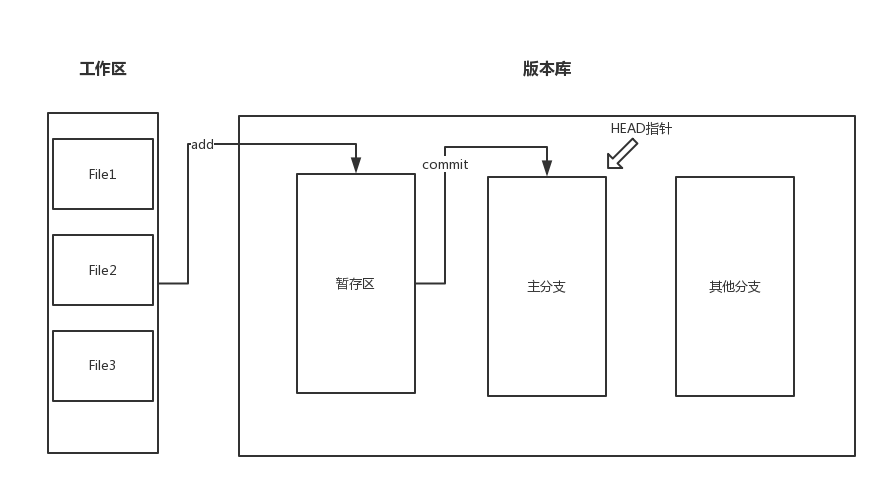

### 回顾
一直以来都有使用版本控制系统，但对其使用仅仅有限几个命令，常常需要去google、百度，趁国庆黄金周做点git的使用笔记，方法以后来查阅

### 安装
windows安装，安装[地址](https://git-scm.com/downloads),安装完成后鼠标右键看到有Git Bash说明安装成功。
安装成功后配置用户名和邮箱地址
```bash
git config --global user.name "your name"
git config --global user.email "you email"
```
***注意 --global代表全局，当前设置环境是全局环境***

### 创建版本库
创建文件夹，
```bash
$ mkdir GitHub
$ cd GitHub
$ git init
```
这样文件夹下有.git 文件夹，这是Git用来跟踪管理仓库的，没事不要动这个文件

创建文件Mycom.js，并编写内容
```js
export default class MyCom extends React.Component{
    constructor(props){
        super(props);
        this.state={
            count:0,
            content:'this is a test page!'
        }
    }
    reder(){
        const {content}=this.state;
        return (
            <div>
                {content}
            </div>
        )
    }
}
```
1. 添加文件到仓库
    ```bash
    $ git add Mycom.js
    ```
2. 添加文件到仓库
    ```bash
    $ git commit -m "新增MyCom文件"
    ```
    ***-m后面跟本次提交说明，易于阅读和版本回退参照***

3. 修改文件提交流程也是两步走，add+commit，与新增文件一样

### 版本回退
#### 返回上一个版本
```bash
$ git reset --hard HEAD^
```
#### 返回指定版本
使用git log 或者 git reflog 查看版本号，根据版本号返回到指定版本
```bash
$ git reset --hard 1094a
```
### Git提交原理
直接上图


### 撤销
撤销工作区到最近一次commit或add的状态
```bash
$ git checkout --<file>
```
如果已经add到暂存区，想要撤销暂存区的修改,
```bash
$ git reset HEAD <file>
```
使用场景
1. 工作区修改后没有添加到暂存区，想放弃工作区的修改，使用命令git checkout --<file>
2. 工作区已经修改，并提交到暂存区,想放弃修改，分两步走，首先使用命令git reset HEAD <file>回到到场景一，之后按照场景一操作
3. 已经提交了不合适的修改到版本库，并没有推送到远程仓库，想要撤销本次修改，使用git reset --hard HEAD^回退到上一个版本

### 删除
#### 删除工作区文件
```bash
$rm <file>
```
#### 删除版本库文件
```bash
$git rm <file>
```
工作区错删文件，从版本库还原
```bash
$git checkout --<file>
```

### 远程仓库
Git是分布式版本控制系统，克隆在多台机器上的仓库没有主次之分。要使用远程仓库，首先，在GitHub上创建账号。其次，创建SSH Key

```bash
$ssh-keygen -t rsa -C "youremail@example.com"
```
电脑用户目录下会生成.ssh目录，里面有id_rsa和id_rsa.pub两文件,这是SSH Key的密钥对,id_rsa是私钥，id_rsa.pub是公钥可以给别人用。
最后登录GitHub账号，打开Account setting，SSH Keys页面，Add SSH Key ，填上任意的title,key文本框中粘上id_rsa.pub中的内容。
提供SSH Key可以让GitHub识别你的电脑确认是你自己推送的内容，而不是别人冒充的，SSH Key可以有多个，让你可以在多台电脑上推送代码（公司、自家屋子里），就问贴不贴心😗。

#### 添加远程仓库
GitHub上创建一个仓库，本地仓库中使用命令连接远程仓库
```bash
$git remote add origin git@GitHub.com:SongZhikuan/SongZhikuan.GitHub.io.git
```
<font color="olive">SongZhikuan</font>是我的GitHub账号,远程库的名字就叫origin，这个名字可以改但一般情况下没有改的必要，origin一看就是远程库，简单明了。

推送当前分支master到远程仓库
```bash
$git push -u origin master
```
由于是第一次master分支，加上了-u的参数，Git不但会把本地master分支的内容推送到远程新的master分支上，还会把本地master分支和远程master分支关联起来，在以后的推送和拉取中可以简化命令
```bash
$git push origin master
```

### 分支管理
创建dev分支并切换到dev分支
```bash
$git checkout -b dev    
```
创建dev分支                
```bash
$git git branch  dev   
```
切换到dev分支
```bash
$git checkout dev   
```
查看当前分支
```bash
$git branch  
```
合并dev分支的内容到当前分支上
```bash
$git merge dev
```
删除分支dev
```bash
$git branch -d dev 
```
#### 分支冲突

master、dev两分支都对README.md文件做了修改并提交到版本库中，分支合并会产生冲突，


手动修改冲突文件README.md,add、commit后合并成功


此过程中使用git log查看详细信息

#### 分支管理
master作为发布稳定版本的分支，dev作为开发分支

准备合并dev分支，请注意--no-ff参数，表示禁用Fast forward：
```bash
$ git merge --no-ff -m "merge with no-ff" dev
```

因为本次合并要创建一个新的commit，所以加上-m参数，把commit描述写进去。